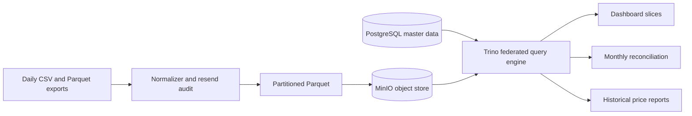

# Annapurna Data Platform

A reproducible retail sales platform for 12 stores. Daily billing exports are normalized to partitioned Parquet in MinIO, master data is stored in PostgreSQL, and Trino federates analytical queries across both systems.

## Verified Result

| Check | Result |
|---|---:|
| Stores | 12 |
| Products | 1,224 |
| Price revisions | 4,320 |
| Original source files | 4,389 |
| Loaded sales rows | 1,120,924 |
| MinIO Parquet objects | 4,389 |
| MinIO data size | 42.34 MB |
| Resend files audited | 68 |
| Partial resends handled | 8 |
| Duplicate-key conflicts | 0 |

The platform was rerun three times. Every run produced `1,120,924` rows with checksum `e0686c3cd5152f92d8b9f9e7ce1dedb1`.

## Platform Architecture



The graph shows the complete path from billing files to MinIO and PostgreSQL, then through Trino to dashboard, pricing, and finance outputs.

## Quick Start

```powershell
docker compose up -d
.\.venv\Scripts\python.exe scripts\build_parquet.py
.\.venv\Scripts\python.exe scripts\upload_to_minio.py
.\.venv\Scripts\python.exe scripts\verify_minio.py
.\.venv\Scripts\python.exe scripts\check_idempotence.py
.\.venv\Scripts\python.exe scripts\reconcile_finance.py
```

For a fresh setup, copy `.env.example` to `.env`, then load `data/reference/masters.sql` into PostgreSQL before running federated Trino queries:

```powershell
Copy-Item .env.example .env
docker compose up -d
docker exec -i annapurna-postgres psql -U annapurna -d annapurna < data/reference/masters.sql
```

The repository includes the processed Parquet data used by the demonstrations. The original raw billing exports are intentionally not committed; `scripts/build_parquet.py` can rebuild the partitions when `SALES_DIR` points to the source export folder.

## Layout

Objects are stored as:

```text
s3://annapurna-sales/sales/business_date=YYYY-MM-DD/store_id=SNN/
```

This lets queries prune by business date and store. Revenue excludes `TAX` and `TENDER`, retains signed `SALE`, `RETURN`, `DISCOUNT`, and `VOID` lines, and joins products by code plus effective date.

## Answers to the Assignment

**(a) Platform and layout.** MinIO is the object store, PostgreSQL holds stores and product masters, and Trino is the analytical query engine. The partition layout is `business_date` then `store_id`. For example, October 2024 for S03 requires 31 files and 398,470 bytes; an unpartitioned folder could require all 4,389 files and 44,399,410 bytes.

**(b) Safe reruns.** Only manifest rows marked `original` are loaded. Resends are audited at `(bill_no, line_no)` and deterministic output files are atomically replaced. Three runs produced 1,120,924 rows and checksum `e0686c3cd5152f92d8b9f9e7ce1dedb1` every time. See [idempotence results](reports/idempotence_runs.csv).

**(c) Dashboard model.** Sales lines are facts; stores, products, and categories are dimensions in PostgreSQL. The semantic view supports store, product category, day-of-week, and month. `TENDER` and `TAX` are excluded from revenue. Product joins use the code and effective sale date because product codes were reissued.

**(d) Historical prices.** The same query selects products and price revisions by their effective date ranges. Change only the `report_period` literal in [temporal_price.sql](sql/temporal_price.sql), for example from March 1 to November 1, 2024.

**(e) Cross-system query.** [cross_system.sql](sql/cross_system.sql) joins Hive/MinIO sales directly to PostgreSQL dimensions through Trino. The verified distributed plan showed a Hive scan for `sales_partitioned`, PostgreSQL scans for `products` and `product_categories`, and Trino joins.

**(f) Reconciliation.** January, February, and April through November match except the documented cases. March differs because finance includes a 486,250 institutional invoice outside the till files; July differs because S07 exports for three days are missing; December differs by 50.48 because finance rounds each bill. See [reconciliation results](reports/reconciliation.csv).

## Reconciliation Output

| Month | Folder revenue | Finance revenue | Explanation |
|---|---:|---:|---|
| March 2024 | 41,971,649.09 | 42,457,899.09 | External institutional invoice: 486,250.00 |
| July 2024 | 40,295,160.11 | 40,527,291.81 | S07 source gap for three lost export days |
| December 2024 | 50,745,259.48 | 50,745,209.00 | Finance rounds each bill to whole rupees |

All other months reconcile to the signed finance figures. The detailed machine-readable result is in [reconciliation.csv](reports/reconciliation.csv).

## Evidence Commands

```powershell
.\.venv\Scripts\python.exe scripts\verify_minio.py
.\.venv\Scripts\python.exe scripts\audit_resends.py
.\.venv\Scripts\python.exe scripts\check_idempotence.py
.\.venv\Scripts\python.exe scripts\reconcile_finance.py
```

Expected key outputs:

```text
Parquet objects: 4389
Verification: PASSED
Audit errors: 0
Duplicate-key rows in originals: 0
Duplicate-key rows in resends: 0
IDEMPOTENCE PASSED
```

## Assignment Evidence

- [Full assignment runbook](docs/assignment_runbook.md)
- [Dashboard semantic view](sql/dashboard_views.sql)
- [Historical price query](sql/temporal_price.sql)
- [Federated Trino query](sql/cross_system.sql)
- [Idempotence results](reports/idempotence_runs.csv)
- [Finance reconciliation](reports/reconciliation.csv)
- [Vendor billing notes](data/reference/billing_notes.md)
